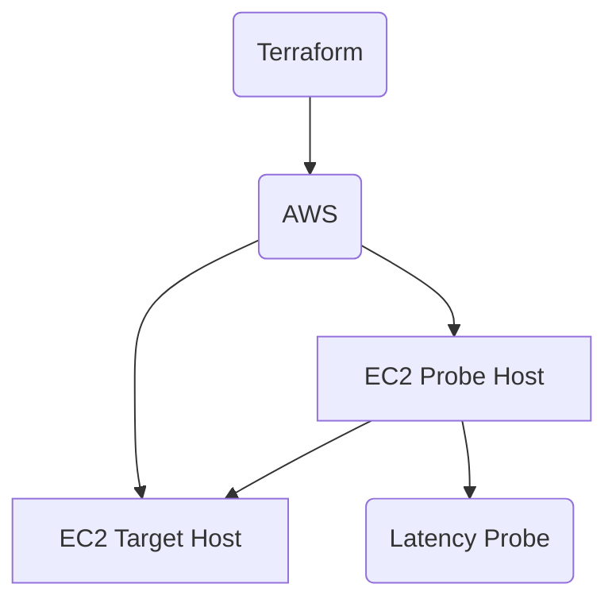

# sample-tf-labs

This is a sample terraform project for the terraform labs.

This lab depends on the latency-probe (https://github.com/haondec/latency-probe) project. The setup script is in data/setup-probe-host.sh will use prebuilt binary.

## Prerequisites

- Terraform
- AWS CLI
- SSH key (gen a new one, or use your own)

## Prepare SSH key

1. If you want to use your own SSH key, update public_key
2. If you want to use a new SSH key, generate a new one using the following command:
```bash
ssh-keygen -t rsa -b 4096 -f ./data/ssh/sample -N ""
```

## Provision

Update your AWS region and account id in the `provider.tf` file.

This one is use local lock, can switch to state lock in DynamoDB/S3.

```bash
# Switch AWS_PROFILE to the one you want to use
export AWS_PROFILE=your-profile

# Initialize the terraform project
terraform init
# Plan the changes
terraform plan
# Apply the changes
terraform apply
```

## Clean up

```bash
terraform destroy
```

## Architecture



It use for demo monitoring latency between two hosts.

Note: I assume latency-probe is a static monitoring app, incase want archive dynamic target base on request body (like blackbox-exporter). Can consider to implement it in the future.

Technologies:

- Terraform (Infra as Code): Simplify the infrastructure management and deployment
- AWS (cloud provider)
- Rust (probe app) - Check latency-probe project for more details
  - Architecture: https://github.com/haondec/latency-probe/blob/main/docs/architecture.md
  - Requirements: https://github.com/haondec/latency-probe/blob/main/docs/requirement.md
- Systemd (service manager) Check `data/setup-probe-host.sh` for more details
- AppConfig (configuration management) (TODO: not used in this lab). Use for dynamic configuration of the probe app when target host changes (IP, port, etc.)

## Result

For check the result, you can use the following command:

```bash
curl -X POST -H "Content-Type: application/json" -d '{"targets": [{"name": "target-host", "host": "10.0.0.1", "protocol": "icmp"}]}' http://localhost:9100/targets
```

For check the result, you can use the following command:

```bash
# Replace your probe host IP (private/public depends on your setup)
curl http://<probe-host-ip>:9100/metrics
```

Output sample AWS:

```text
# HELP probe_latency_milliseconds_current Current probe latency in milliseconds
# TYPE probe_latency_milliseconds_current gauge
probe_latency_milliseconds_current{probe_type="icmp",target="10.0.1.19"} 0.220409
```

Output sample websocket:

```text
# HELP probe_latency_milliseconds_current Current probe latency in milliseconds
# TYPE probe_latency_milliseconds_current gauge
probe_latency_milliseconds_current{probe_type="http",target="echo.websocket.org"} 261.43789
probe_latency_milliseconds_current{probe_type="icmp",target="echo.websocket.org"} 0.653003
probe_latency_milliseconds_current{probe_type="tcp_connect",target="echo.websocket.org"} 3.646006
# HELP probe_timeout_total Total number of probe timeouts
# TYPE probe_timeout_total counter
probe_timeout_total{probe_type="http",target="echo.websocket.org"} 90
```

It compatible with Prometheus and Grafana.

Example scraping config:

```yaml
scrape_configs:
  - job_name: 'latency-probe'
    scrape_interval: 30s
    metrics_path: '/metrics'
    static_configs:
      - targets: ['<probe-host-ip>:9100']
```

Grafana

